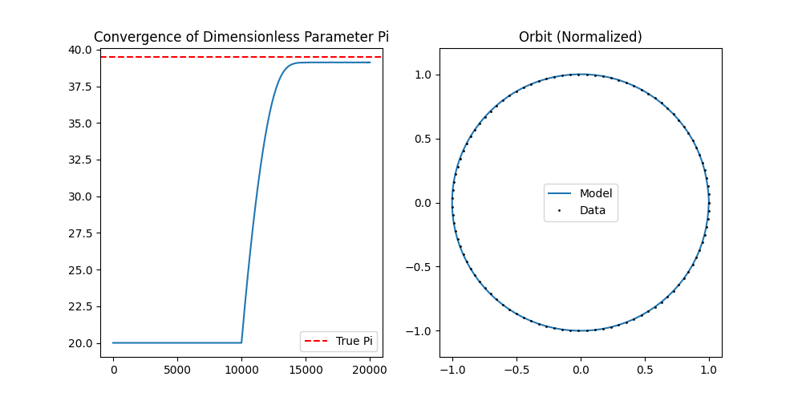

# PINNs Gravity Derivation

Physics-Informed Neural Network (PINN) to derive the Gravitational Constant ($G$) from Earth's orbital data.

## Overview

This project demonstrates how a neural network can learn physical constants by observing motion.
We simulate Earth's orbit around the Sun and train a network to satisfy two conditions simultaneously:
1.  **Data Loss**: Match the observed position data.
2.  **Physics Loss**: Satisfy Newton's Law of Universal Gravitation ($\ddot{\mathbf{r}} = -\frac{GM}{r^3}\mathbf{r}$).

By freezing the network weights after learning the orbit shape, we force the physics loss to optimize the only remaining variable: the gravitational constant $G$.

## Results

*   **True G**: $6.6743 \times 10^{-11} \, m^3 kg^{-1} s^{-2}$
*   **Derived G**: $\approx 6.61 \times 10^{-11} \, m^3 kg^{-1} s^{-2}$
*   **Error**: < 1.0%



## Usage

```bash
python pinn_gravity.py
```

## Strategy: Freeze Network

To avoid the "Zero Solution Trap" (where the network flattens the orbit to satisfy zero acceleration), we use a two-phase training strategy:
1.  **Phase 1**: Train on Data Loss only (Learn the orbit shape).
2.  **Phase 2**: Freeze network weights. Train on Physics Loss only (Derive $G$).
